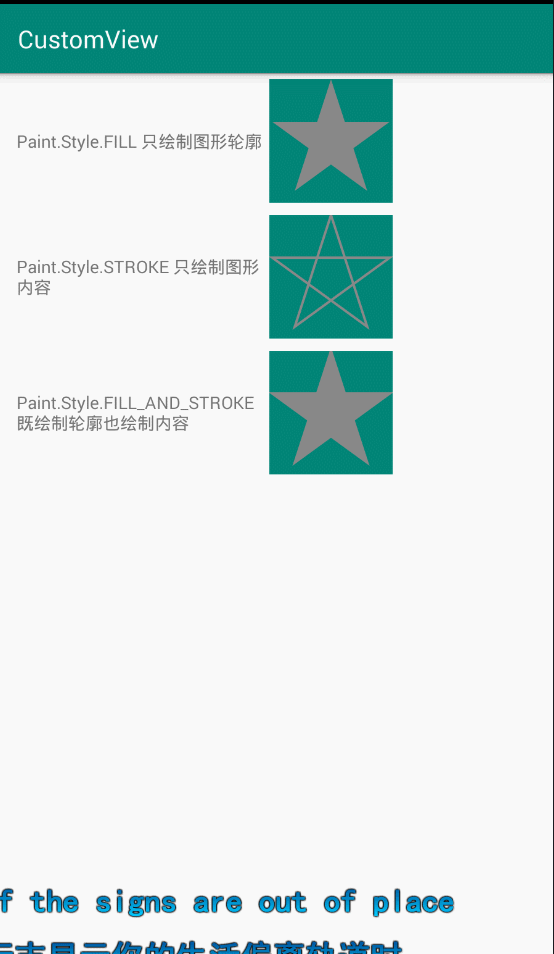

# Android自定义控件开发入门和实战
### 第五章动画进阶
###### 1、PathMeasure类的使用
[示例代码](../fly/rotate/com/animator/AnimatorPathMeasureExample.java)



 PathMeasure：创建与指定路径对象关联的路径度量对象(已创建并指定)。度量对象现在可以返回路径的长度，以及任意位置的位置和切线路径。
```
//构造方法
public PathMeasure() {
         mPath = null;
         native_instance = native_create(0, false);
     }
/**
 * @param path The path that will be measured by this object
 * @param forceClosed If true, then the path will be considered as "closed"
 *        even if its contour was not explicitly closed.
 */
public PathMeasure(Path path, boolean forceClosed) {
    // The native implementation does not copy the path, prevent it from being GC'd
    mPath = path;
    native_instance = native_create(path != null ? path.readOnlyNI() : 0,
                                    forceClosed);
}
     
```

> 注意事项
> ***在OnDraw()函数中创建变量是非常不明智的行为，因为onDraw()函数会被在每次重绘刷新界面时调用***
>  使用getSegment()需要关闭硬件加速，如果不关闭硬件加速，使用getSegment()函数无效，使用getSegment()函数进行的路径动画无效
>         setLayerType(LAYER_TYPE_SOFTWARE,null);

**常用方法**
* public float getLength()：用于获取计算的路径长度，当forceClosed为true时，会当做Path是闭合的状态来计算路径长度
* public boolean isClosed():判断测量Path时是否计算闭合。当forceClosed为true时，这个函数一定返回true
* public boolean getSegment(float startD, float stopD, Path dst, boolean startWithMoveTo):

         该方法用于截取整个Path中的某个片段，通过startD和stopD来控制截取的长度，并将截取后的Path添加到参数dst中
         此处destPath需要重置，因为getSegment方法中的dst参数中保存的Path是不断添加的
         getSegment方法的startWithMoveTo参数：
                               为true时，被截取出来的Path片段保持原状
                               为false时，则会将截取出来的Path片段的起始点移动到dst的最后一个点（画线的点坐标）
* public boolean nextContour():移动到路径中的下一个轮廓。如果存在，返回true 如果路径结束，则为false
* public boolean getPosTan(float distance, float pos[], float tan[])：

          引脚距离为0 <= distance <= getLength()，然后计算对应的位置和切线。如果没有路径，返回false，
          或指定一个零长度路径，在这种情况下，位置和切线是不变。
          distance： 距离，当前轮廓到样本的距离
          pos如果不为空，返回采样位置(x==[0]， y==[1])
          tan如果不为null，返回采样的切线(x==[0]， y==[1])
          如果没有与该度量对象关联的路径，则返回false

